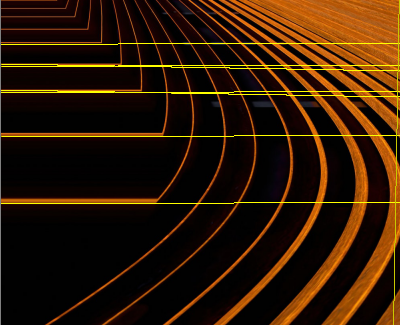
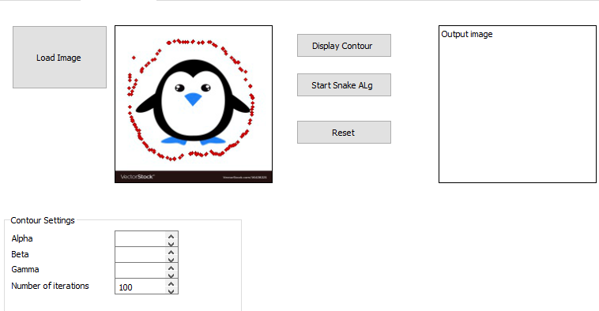
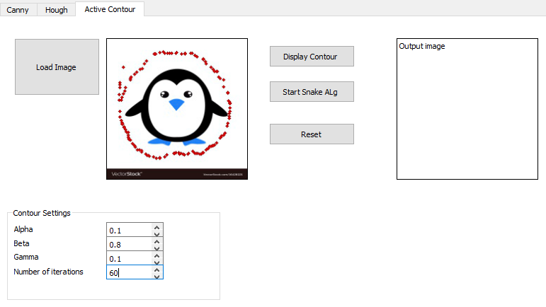

# &emsp;&emsp;**`Computer Vision "Snake Algorithm"`**
# &emsp;**` "CannyEdge Detection" & Hough Algorithm"`**
# **`Team 4`** :
### 1- Galal Hossam &emsp;&emsp;&emsp;&emsp;2- Mohammed Omar 
### 3- Zeinab Walid &emsp;&emsp;&emsp;&emsp;4- Mohammed El-Sayed 

# **`ABOUT`**
### In our project we apply hough line and circle detection algorithm, and canny edge detection and active contour detection (snake) from scratch on some pictures.
# **`Uploaded Files`** 
### We have uploaded 3 files :
### 1- main.py -- This includes the main functions to run the GUI and maintain user interface with handle of common errors by implement error function.
### 2- GUI.py -- The entire gui file as we implement it using QT designer and use pyqt5.
### 3- out_imgs -- This folder contain the output images of the GUI.
### 4- imgs_test -- This folder contain the the images that we use to test our gui.

# **`GUI Output`**
### 1- Canny edge detction on the lena image. 

### 2- Hough algorithm
### We have two threshold to be set as minimum value for two algorithms.
### i) Line Detection

 
### ii) Circle Detection

### 3- Active contour detection (Snake algorithm)
### We use the equation of the discrete model to update our points by going to the neighbor of 5*5 window that minimize the energy.

### Here are another examples:

# **`Notes`**
### All Noise,Filters,convolution function,Padding & Canny edge detection are applied using their main equation.

# **`DEPENDENCIES`**
### main.py was written in Python 3, using libraries,you only need to install it using pip3 install.

# **`HOW TO USE`**
### you must install all dependencies that is not included in your device and just run any file by typing in terminal `python file_name.py.`

