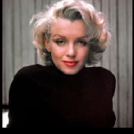

# &emsp;&emsp;**`Computer Vision "Noise,Filters`**
# &emsp;&emsp;**` Edge Detection & Hyprid Images"`**
# **`Team 4`** :
### 1- Galal Hossam &emsp;&emsp;&emsp;&emsp;2- Mohammed Omar 
### 3- Zeinab Walid &emsp;&emsp;&emsp;&emsp;4- Mohammed El-Sayed 

# **`ABOUT`**
### We use standerd image to introduce our work and compare it with national standerds so all our images is apply on "Lena image"

# **`Uploaded Files`** 
### We have uploaded 3 files :
### 1- main.py -- This includes the main functions to run the GUI and maintain user interface with handle of common errors by implement error function.
### 2- GUI8.py -- The entire gui file as we implement it using QT designer and use pyqt5.
### 3- logging -- This logging file is to track user interface and help us to know errors source.
### 4- out_imgs -- This folder contain the output images of the GUI.

# **`GUI Output`**
### 1- Selecct image & Convert to Gray scale image

### 2- Apply noise to image
### i) Uniform Noise

### ii) Gaussian Noise 

### iii) Salt&Papper Noise

### 3- Apply Low pass filters to noisy image
### i) Gaussian Filter

### ii) Avrage Filter 

### iii) Median Filter

### 3- Apply High pass filters to noisy image
### i) Perwit Filter

### ii) Sobel Filter 

### iii) Robert Filter

### iv) Canny Edge Detection 

### 4- Apply Histogram to image & get its distribution curve

### 5- Apply equalization on the image for enhance.

### 6- Apply Normalization Local & Global threshold.

### 7- Apply Frequency filters 
### we first apply Fourier to the image and then make padding to the low & high pass filters and then convert to frequency domain too , then make Fourier shift and multiply the output of the image and filter and then get the Fourier inverse.

### 8- Get the histogram of all of the colored image channels "R,G,B"

### 9- We use two main stranded images to provide the hybrid image of both
### Here is the two images and its hybrid image
  
### The main tap in GUI for hybrid images apply , As we provide images in process.

# **`Notes`**
### All Noise,Filters,convolution function,Padding & Canny edge detection are applied using their main equation.

# **`DEPENDENCIES`**
### main.py was written in Python 3, using libraries,you only need to install it using pip3 install.

# **`HOW TO USE`**
### you must install all dependences that is not included in your device and just run any file by typing in terminal `python file_name.py.`

