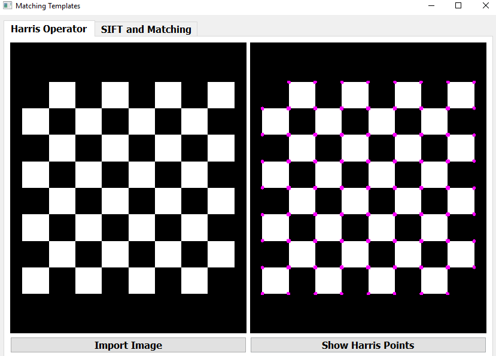
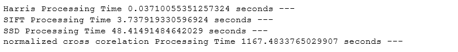

# &emsp;&emsp;**`Computer Vision "Harris Operator"`**
# &emsp;&emsp;&emsp;**` "SIFT" & Templete Matching"`**
# **`Team 4`** :
### 1- Galal Hossam &emsp;&emsp;&emsp;&emsp;2- Mohammed Omar 
### 3- Zeinab Walid &emsp;&emsp;&emsp;&emsp;4- Mohammed El-Sayed 

# **`ABOUT`**
### In our project we apply Harris operator to get the key-points of the image and then apply sift algorithm for each point of these points and get a 128 vector that describe each point and then make the same process on the template image and the make matching between the two descriptors matrix of the two images using the SSD & normalized cross correlation matching and mark the matching points in both images from scratch on some pictures.

# **`Uploaded Files`** 
### We have uploaded 3 files :
### 1- main.py -- This includes the main functions to run the GUI and maintain user interface with handle of common errors by implement error function.
### 2- ui.py -- The entire gui file as we implement it using QT designer and use pyqt5.
### 3- out -- This folder contain the output images of the GUI.
### 4- imgs_test -- This folder contain the the images that we use to test our gui.

# **`GUI Output`**
### 1- Harris points  
### Simple example 

### More hard image 

 

### 2- Sift & Matching
### we apply sift and use matching to test it.
### i) SSD Matching

 
### ii) Normalized Cross Correlation Matching

### 3 -Operation processing time 

### Notes: It seems that the operation of the normalized cross correlation increase the computation a lot but give better results.

# **`DEPENDENCIES`**
### main.py was written in Python 3, using libraries,you only need to install it using pip3 install.

# **`HOW TO USE`**
### you must install all dependencies that is not included in your device and just run any file by typing in terminal `python file_name.py.`

